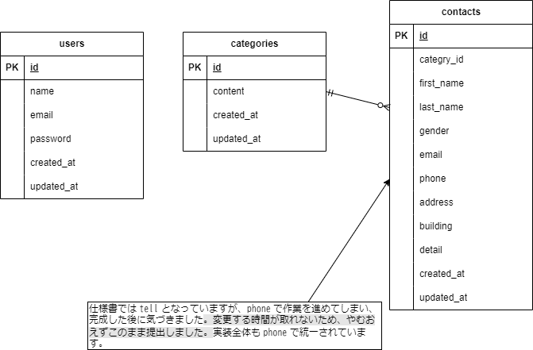

# お問い合わせフォーム

## 環境構築

### Docker ビルド

1. `git clone` でリポジトリを取得
2. `docker-compose up -d --build` でコンテナを起動
3. MySQL の設定を OS にあわせて調整（必要な場合）

### Laravel 環境構築

1. `docker-compose exec php bash` でコンテナの PHP に入る
2. `composer install` で必要なパッケージをインストール
3. `.env.example` を `.env` にコピーし、環境変数を設定
4. `php artisan key:generate` でアプリケーションキーを作成
5. `php artisan migrate` でデータベースのテーブルを作成
6. `php artisan db:seed` でダミーデータを作成

## 使用技術（実行環境）

- PHP 8.0
- Laravel 10.0
- MySQL 8.0
- Docker

## ER図

（ここに ER 図の画像を貼る）

## URL

- 開発環境: [http://localhost](http://localhost)
- phpMyAdmin: [http://localhost:8080](http://localhost:8080)
